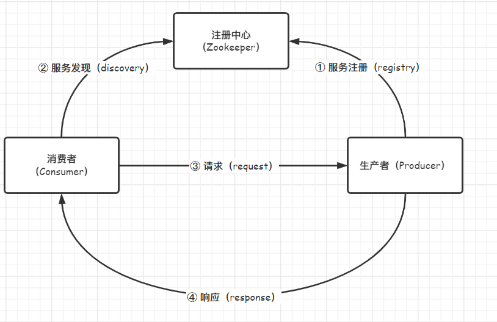

# simple-rpc
Zookeeper + Netty 简单实现 RPC 框架

# 整体设计

### 整体架构




# 使用方法

注意：需要提前启动 Zookeeper 才能正常运行

### 1. 创建 simple-rpc-demo-api 工程，编写接口定义

```java
package icu.sunnyc.rpc.demo.api;

/**
 * 示例接口
 * @author: houcheng
 * @date: 2022/5/31 16:26:10
 */
public interface HelloService {

    /**
     * 示例方法
     * @param name 字符串参数
     * @return String
     */
    String hello(String name);

    /**
     * 返回这个学生一年后的样子
     * @param student 学生对象
     * @return 一年后的学生对象
     */
    Student oneYearLater(Student student);

}
```

### 2. 创建 simple-rpc-demo-producer 工程

#### 2.1 依赖 api 和 simple-rpc-core （即 simple-rpc 核心代码工程）

```xml
<dependencies>
    <!-- api -->
    <dependency>
        <groupId>icu.sunnyc</groupId>
        <artifactId>simple-rpc-demo-api</artifactId>
        <version>${project.version}</version>
    </dependency>

    <!-- rpc-core -->
    <dependency>
        <groupId>icu.sunnyc</groupId>
        <artifactId>simple-rpc-core</artifactId>
        <version>${project.version}</version>
    </dependency>

</dependencies>
```

#### 2.2 添加 simple-rpc.properties 配置文件

在 src/main/resources 下新建 simple-rpc.properties 配置文件，此配置文件名称不能修改，写入以下内容：

```properties
# Zookeeper connection string
# 注册中心地址
registry.address=127.0.0.1:2181

# RpcServer port
# 你的 rpc 服务端启动地址
service.address=127.0.0.1:13356
```

#### 2.3 实现 simple-rpc-demo-api 中定义的接口

```java
package icu.sunnyc.rpc.demo.producer.impl;

import icu.sunnyc.rpc.core.annotation.RpcService;
import icu.sunnyc.rpc.demo.api.HelloService;
import icu.sunnyc.rpc.demo.api.Student;

/**
 * HelloService 实现类
 * @author: houcheng
 * @date: 2022/5/31 16:30:43
 */
@RpcService(HelloService.class)
public class HelloServiceImpl implements HelloService {

    @Override
    public String hello(String name) {
        return "Hello " + name;
    }

    @Override
    public Student oneYearLater(Student student) {
        System.out.println("生产者收到学生信息：" + student);
        // 一年后年龄 + 1
        student.setAge(student.getAge() + 1);
        return student;
    }
}
```

#### 2.4 编写生产者（服务提供者）启动类

```java
package icu.sunnyc.rpc.demo.producer;

import icu.sunnyc.rpc.core.RpcApplication;

/**
 * RPC 服务启动类 启动自动注册服务
 * @author: houcheng
 * @date: 2022/5/31 16:50:03
 */
public class ProducerApplication {

    public static void main(String[] args) {
        RpcApplication.run(ProducerApplication.class);
    }
}
```

### 3. 创建 simple-rpc-demo-consumer 工程

#### 3.1 依赖 api 和 simple-rpc-core

```xml
<dependencies>
    <!-- api -->
    <dependency>
        <groupId>icu.sunnyc</groupId>
        <artifactId>simple-rpc-demo-api</artifactId>
        <version>${project.version}</version>
    </dependency>

    <!-- rpc-core -->
    <dependency>
        <groupId>icu.sunnyc</groupId>
        <artifactId>simple-rpc-core</artifactId>
        <version>${project.version}</version>
    </dependency>

</dependencies>
```

#### 3.2 添加 simple-rpc.properties 配置文件

在 src/main/resources 下新建 simple-rpc.properties 配置文件，此配置文件名称不能修改，写入以下内容：

```properties
# Zookeeper connection string
# 调用端如果不提供服务的话，只需要配置注册中心地址即可
registry.address=127.0.0.1:2181
```

#### 3.3 编写消费者（服务调用者）启动类

```java
package icu.sunnyc.rpc.demo.consumer;


import icu.sunnyc.rpc.core.RpcApplication;
import icu.sunnyc.rpc.core.annotation.SimpleReference;
import icu.sunnyc.rpc.demo.api.HelloService;
import icu.sunnyc.rpc.demo.api.Student;
import org.springframework.context.annotation.AnnotationConfigApplicationContext;
import org.springframework.stereotype.Component;

import java.util.Random;

/**
 * RPC 调用测试
 * @author: houcheng
 * @date: 2022/6/1 16:43:05
 */
@Component
public class ConsumerApplication {

    @SimpleReference
    private HelloService helloService;

    public static void main(String[] args) {
        AnnotationConfigApplicationContext context = RpcApplication.run(ConsumerApplication.class);
        ConsumerApplication consumerApplication = context.getBean(ConsumerApplication.class);
        
        // 简单参数类型调用
        System.out.println(consumerApplication.sayHello("sunnyc"));

        // 复杂参数类型调用
        consumerApplication.callOneYearLater();
    }

    public String sayHello(String name) {
        return helloService.hello(name);
    }

    public void callOneYearLater() {
        Student student = new Student();
        student.setName("sunnyc");
        student.setAge(18);
        student.setGender("male");
        System.out.println("一年前的学生：" + student);
        System.out.println("一年后的学生：" + helloService.oneYearLater(student));
    }

}
```

### 4. 验证

先启动生产者，再启动消费者进行调用，不出意外消费者控制台会出现以下内容：

```console
...省略若干日志
Hello sunnyc
一年前的学生：Student{name='sunnyc', age=18, gender='male'}
...省略调用过程的日志
一年后的学生：Student{name='sunnyc', age=19, gender='male'}
```

